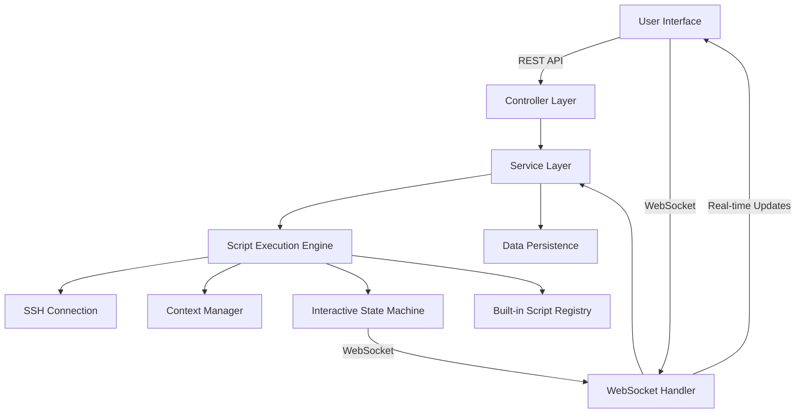
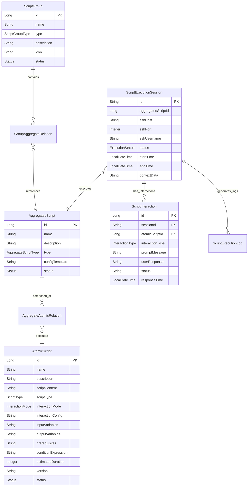

# SSH Terminal Management System - Design Specification

**Version**: 1.0  
**Date**: 2025-08-01  
**Status**: Final Implementation Guide

## Overview

This document provides the comprehensive design architecture for the SSH Terminal Management System, covering the complete implementation of atomic scripts, aggregated workflows, interactive execution, and real-time user interfaces.

## 1. System Architecture

### 1.1 High-Level Architecture

The system follows a layered architecture with clear separation of concerns:

```
┌─────────────────────────────────────────────────────────────┐
│                Frontend Layer (Vue 3 + Element Plus)        │
├─────────────────────────────────────────────────────────────┤
│  User Interface               │   Admin Interface            │
│  - Script Group Dashboard     │  - Atomic Script Management  │
│  - Real-time Execution View   │  - Aggregated Script Builder │
│  - Interactive Modal System   │  - User & Permission Mgmt    │
│  - WebSocket Communication    │  - System Monitoring         │
└─────────────────────────────────────────────────────────────┘
┌─────────────────────────────────────────────────────────────┐
│                Backend Services (Spring Boot 3.0.2)         │
├─────────────────────────────────────────────────────────────┤
│  Controller Layer             │   Service Layer               │
│  - REST API Endpoints         │  - Script Execution Engine   │
│  - WebSocket Handlers         │  - Interactive Execution Mgr │
│  - Role-based Security        │  - Context Management        │
│                               │  - SSH Connection Pool       │
└─────────────────────────────────────────────────────────────┘
┌─────────────────────────────────────────────────────────────┐
│              Core Engine & Data Layer                        │
├─────────────────────────────────────────────────────────────┤
│  Script Engine                │   Data Persistence            │
│  - Built-in Script Registry   │  - JPA Entity Relationships  │
│  - Command Chain Execution    │  - MySQL Database            │
│  - Context Variable Manager   │  - Execution History         │
│  - Interactive State Machine  │  - Configuration Storage     │
└─────────────────────────────────────────────────────────────┘
```

### 1.2 Component Interaction Flow



## 2. Data Model Design

### 2.1 Core Entity Relationships



### 2.2 Enumeration Definitions

```java
// Script Type Classification
public enum ScriptType {
    BUILT_IN_TEMPLATE,    // Parameterized built-in scripts (MySQL, Redis)
    BUILT_IN_STATIC,      // Non-parameterized built-in scripts (DetectOS)
    USER_DEFINED          // User-created custom scripts
}

// Aggregated Script Types
public enum AggregateScriptType {
    PROJECT_SPECIFIC,     // Bound to specific project context
    GENERIC_TEMPLATE,     // Reusable with configuration templates
    UTILITY_COLLECTION    // Common utility script collections
}

// Script Group Organization
public enum ScriptGroupType {
    PROJECT_DIMENSION,    // Project-oriented grouping
    FUNCTION_DIMENSION,   // Function-oriented grouping
    SYSTEM_MANAGEMENT     // System administration grouping
}

// Interactive Execution Types
public enum InteractionType {
    CONFIRMATION,         // Yes/No confirmations
    TEXT_INPUT,          // General text input
    PASSWORD_INPUT,      // Secure password input
    SELECTION           // Multiple choice selection
}
```

## 3. Backend Architecture Design

### 3.1 Service Layer Architecture

#### 3.1.1 Script Execution Engine

```java
@Service
public class InteractiveScriptExecutor {
    
    private final ScriptInteractionService interactionService;
    private final EnhancedScriptContext contextManager;
    private final WebSocketTemplate webSocketTemplate;
    private final Map<String, CompletableFuture<String>> pendingInteractions;
    
    public ScriptExecutionSession executeAggregatedScript(
            AggregatedScript script, 
            SshConnectionConfig sshConfig,
            Map<String, Object> initialParameters) {
        
        // 1. Initialize execution session
        ScriptExecutionSession session = createExecutionSession(script, sshConfig);
        
        // 2. Create enhanced context with initial parameters
        EnhancedScriptContext context = new EnhancedScriptContext(session.getId());
        context.addVariables(initialParameters);
        
        // 3. Execute atomic scripts in sequence
        for (AggregateAtomicRelation relation : script.getAtomicScriptRelations()) {
            if (shouldExecuteStep(relation, context)) {
                executeAtomicScript(relation.getAtomicScript(), context, session);
            }
        }
        
        return session;
    }
    
    private void executeAtomicScript(AtomicScript script, 
                                   EnhancedScriptContext context, 
                                   ScriptExecutionSession session) {
        
        // Handle interactive scripts
        if (script.getInteractionMode() == InteractionMode.INTERACTIVE) {
            handleInteractiveExecution(script, context, session);
        } else {
            executeNonInteractiveScript(script, context, session);
        }
    }
    
    private void handleInteractiveExecution(AtomicScript script, 
                                          EnhancedScriptContext context, 
                                          ScriptExecutionSession session) {
        
        // 1. Create interaction request
        InteractionRequest request = buildInteractionRequest(script, context);
        
        // 2. Persist interaction state
        ScriptInteraction interaction = interactionService.createInteraction(
            session, script, request);
        
        // 3. Send WebSocket message to frontend
        webSocketTemplate.convertAndSend(
            "/topic/execution/" + session.getId() + "/interaction", 
            request);
        
        // 4. Wait for user response (with timeout)
        CompletableFuture<String> future = new CompletableFuture<>();
        pendingInteractions.put(interaction.getId().toString(), future);
        
        try {
            String userResponse = future.get(5, TimeUnit.MINUTES);
            
            // 5. Process response and continue execution
            processUserResponse(script, context, userResponse);
            
        } catch (TimeoutException e) {
            handleInteractionTimeout(interaction);
        }
    }
    
    public void handleUserResponse(Long interactionId, InteractionResponse response) {
        CompletableFuture<String> future = pendingInteractions.remove(interactionId.toString());
        if (future != null) {
            future.complete(response.getResponseData());
        }
    }
}
```

#### 3.1.2 Context Management System

```java
public class EnhancedScriptContext {
    
    private final String sessionId;
    private final Map<String, Object> variables;
    private final Map<String, Object> metadata;
    
    public EnhancedScriptContext(String sessionId) {
        this.sessionId = sessionId;
        this.variables = new ConcurrentHashMap<>();
        this.metadata = new ConcurrentHashMap<>();
    }
    
    // Variable management
    public void setVariable(String key, Object value, VariableScope scope) {
        String scopedKey = scope.name().toLowerCase() + ":" + key;
        variables.put(scopedKey, value);
        persistToDatabase();
    }
    
    public <T> T getVariable(String key, Class<T> type, VariableScope scope) {
        String scopedKey = scope.name().toLowerCase() + ":" + key;
        Object value = variables.get(scopedKey);
        return type.cast(value);
    }
    
    // Conditional evaluation
    public boolean evaluateCondition(String expression) {
        if (expression == null || expression.trim().isEmpty()) {
            return true;
        }
        
        // Support variable substitution: "#{os_info.id} == 'ubuntu'"
        String resolvedExpression = resolveVariables(expression);
        
        // Use SpEL or simple expression evaluator
        return evaluateExpression(resolvedExpression);
    }
    
    // Context serialization for persistence
    public String toJson() {
        Map<String, Object> contextData = Map.of(
            "sessionId", sessionId,
            "variables", variables,
            "metadata", metadata
        );
        return JsonUtils.toJson(contextData);
    }
    
    public static EnhancedScriptContext fromJson(String json) {
        Map<String, Object> contextData = JsonUtils.fromJson(json, Map.class);
        EnhancedScriptContext context = new EnhancedScriptContext(
            (String) contextData.get("sessionId"));
        context.variables.putAll((Map<String, Object>) contextData.get("variables"));
        context.metadata.putAll((Map<String, Object>) contextData.get("metadata"));
        return context;
    }
}
```

#### 3.1.3 Built-in Script Registry

```java
@Service
public class UnifiedScriptRegistry {
    
    private final Map<String, UnifiedAtomicScript> builtInScripts = new ConcurrentHashMap<>();
    private final Map<Long, UnifiedAtomicScript> configurableScripts = new ConcurrentHashMap<>();
    private final Map<String, List<UnifiedAtomicScript>> tagIndex = new ConcurrentHashMap<>();
    
    public void registerBuiltInScript(Command command, String scriptId, String[] tags) {
        UnifiedAtomicScript script = UnifiedAtomicScript.fromBuiltInCommand(command, scriptId);
        builtInScripts.put(scriptId, script);
        indexByTags(script, tags);
    }
    
    public void registerConfigurableScript(AtomicScript atomicScript) {
        UnifiedAtomicScript script = UnifiedAtomicScript.fromAtomicScript(atomicScript);
        configurableScripts.put(atomicScript.getId(), script);
        
        // Auto-tag based on script type and content
        String[] autoTags = generateAutoTags(atomicScript);
        indexByTags(script, autoTags);
    }
    
    public List<UnifiedAtomicScript> getScriptsByTag(String tag) {
        return tagIndex.getOrDefault(tag, Collections.emptyList());
    }
    
    public Optional<UnifiedAtomicScript> findScript(String scriptId) {
        return Optional.ofNullable(builtInScripts.get(scriptId));
    }
    
    public ScriptRegistryStats getStats() {
        return new ScriptRegistryStats(
            builtInScripts.size(),
            configurableScripts.size(),
            tagIndex.size()
        );
    }
}
```

### 3.2 WebSocket Communication Design

#### 3.2.1 Message Protocol

```java
// Base message structure
public abstract class ExecutionMessage {
    private String type;
    private String sessionId;
    private LocalDateTime timestamp;
    private Map<String, Object> payload;
}

// Specific message types
public class LogMessage extends ExecutionMessage {
    private String logLevel;     // INFO, SUCCESS, ERROR, WARN, DEBUG
    private String stepName;     // Current atomic script name
    private String message;      // Log content
}

public class StatusUpdateMessage extends ExecutionMessage {
    private ExecutionStatus status;  // RUNNING, SUCCESS, FAILED, CANCELLED
    private String currentStep;      // Current atomic script
    private Integer progress;        // Percentage complete
}

public class InteractionRequestMessage extends ExecutionMessage {
    private Long interactionId;      // Database interaction ID
    private InteractionType type;    // CONFIRMATION, TEXT_INPUT, PASSWORD_INPUT
    private String prompt;           // Message to display to user
    private List<String> options;    // For selection type interactions
    private Map<String, Object> inputFields;  // For complex input forms
}
```

#### 3.2.2 WebSocket Handler Implementation

```java
@Component
public class ScriptExecutionWebSocketHandler {
    
    @MessageMapping("/execution/{sessionId}/respond")
    public void handleInteractionResponse(
            @DestinationVariable String sessionId,
            InteractionResponse response,
            SimpMessageHeaderAccessor headerAccessor) {
        
        // Validate user session and permissions
        String userId = getUserFromSession(headerAccessor);
        if (!validateSessionAccess(sessionId, userId)) {
            throw new AccessDeniedException("Unauthorized access to execution session");
        }
        
        // Forward response to execution engine
        scriptExecutor.handleUserResponse(response.getInteractionId(), response);
    }
    
    @EventListener
    public void handleExecutionEvent(ScriptExecutionEvent event) {
        
        String destination = switch (event.getType()) {
            case LOG -> "/topic/execution/" + event.getSessionId();
            case STATUS_UPDATE -> "/topic/execution/" + event.getSessionId() + "/status";
            case INTERACTION_REQUEST -> "/topic/execution/" + event.getSessionId() + "/interaction";
        };
        
        messagingTemplate.convertAndSend(destination, event.getPayload());
    }
}
```

## 4. Frontend Architecture Design

### 4.1 Component Structure

```
src/
├── views/
│   ├── user/
│   │   ├── Home.vue                    # Script group dashboard
│   │   ├── ScriptExecution.vue         # Real-time execution interface
│   │   └── ExecutionHistory.vue        # Historical execution logs
│   └── admin/
│       ├── AtomicScripts.vue           # Atomic script management
│       ├── AggregatedScripts.vue       # Aggregated script management
│       ├── ScriptGroups.vue            # Group organization
│       └── ScriptBuilder.vue           # Visual workflow builder
├── components/
│   ├── InteractionModal.vue            # Real-time interaction handler
│   ├── ScriptParameterForm.vue         # Dynamic parameter input
│   ├── ExecutionLogViewer.vue          # Real-time log display
│   └── ScriptWorkflowCanvas.vue        # Drag-and-drop workflow editor
└── utils/
    ├── websocket.js                    # WebSocket connection management
    ├── http.js                         # HTTP client with interceptors
    └── scriptValidation.js             # Client-side script validation
```

### 4.2 Real-Time Interaction System

#### 4.2.1 InteractionModal Component

```vue
<template>
  <el-dialog
    v-model="visible"
    :title="request?.prompt || '用户交互'"
    :close-on-click-modal="false"
    :close-on-press-escape="false"
    width="500px"
  >
    <!-- Confirmation Type -->
    <div v-if="request?.type === 'CONFIRMATION'" class="interaction-content">
      <p>{{ request.prompt }}</p>
      <div class="action-buttons">
        <el-button @click="submitResponse('no')">否</el-button>
        <el-button type="primary" @click="submitResponse('yes')">是</el-button>
      </div>
    </div>
    
    <!-- Text Input Type -->
    <div v-else-if="request?.type === 'TEXT_INPUT'" class="interaction-content">
      <p>{{ request.prompt }}</p>
      <el-input
        v-model="inputValue"
        :placeholder="request.placeholder"
        @keyup.enter="submitTextInput"
      />
      <div class="action-buttons">
        <el-button @click="submitTextInput" type="primary">提交</el-button>
      </div>
    </div>
    
    <!-- Password Input Type -->
    <div v-else-if="request?.type === 'PASSWORD_INPUT'" class="interaction-content">
      <p>{{ request.prompt }}</p>
      <el-input
        v-model="inputValue"
        type="password"
        show-password
        :placeholder="request.placeholder"
        @keyup.enter="submitTextInput"
      />
      <div class="action-buttons">
        <el-button @click="submitTextInput" type="primary">提交</el-button>
      </div>
    </div>
  </el-dialog>
</template>

<script setup>
import { ref, computed } from 'vue'

const props = defineProps({
  modelValue: Object  // InteractionRequest
})

const emit = defineEmits(['update:modelValue', 'submit'])

const visible = computed({
  get: () => !!props.modelValue,
  set: (value) => {
    if (!value) {
      emit('update:modelValue', null)
    }
  }
})

const request = computed(() => props.modelValue)
const inputValue = ref('')

const submitResponse = (response) => {
  emit('submit', {
    interactionId: request.value.interactionId,
    responseData: response
  })
  visible.value = false
}

const submitTextInput = () => {
  if (inputValue.value.trim()) {
    submitResponse(inputValue.value.trim())
    inputValue.value = ''
  }
}
</script>
```

#### 4.2.2 WebSocket Management

```javascript
// utils/websocket.js
import { Client } from '@stomp/stompjs'
import SockJS from 'sockjs-client'

class WebSocketManager {
  constructor() {
    this.client = null
    this.subscriptions = new Map()
    this.reconnectDelay = 1000
    this.maxReconnectDelay = 30000
  }
  
  connect(endpoint = '/ws/stomp') {
    return new Promise((resolve, reject) => {
      this.client = new Client({
        webSocketFactory: () => new SockJS(endpoint),
        connectHeaders: {
          // Add authentication headers if needed
        },
        debug: (str) => {
          console.log('STOMP Debug:', str)
        },
        reconnectDelay: this.reconnectDelay,
        heartbeatIncoming: 4000,
        heartbeatOutgoing: 4000,
      })
      
      this.client.onConnect = (frame) => {
        console.log('WebSocket Connected:', frame)
        this.reconnectDelay = 1000 // Reset reconnect delay
        resolve(this.client)
      }
      
      this.client.onStompError = (frame) => {
        console.error('WebSocket STOMP Error:', frame)
        reject(new Error(frame.headers['message']))
      }
      
      this.client.onWebSocketError = (event) => {
        console.error('WebSocket Error:', event)
        this.handleReconnect()
      }
      
      this.client.activate()
    })
  }
  
  subscribe(destination, callback) {
    if (!this.client || !this.client.connected) {
      throw new Error('WebSocket not connected')
    }
    
    const subscription = this.client.subscribe(destination, (message) => {
      try {
        const data = JSON.parse(message.body)
        callback(data)
      } catch (error) {
        console.error('Error parsing WebSocket message:', error)
      }
    })
    
    this.subscriptions.set(destination, subscription)
    return subscription
  }
  
  unsubscribe(destination) {
    const subscription = this.subscriptions.get(destination)
    if (subscription) {
      subscription.unsubscribe()
      this.subscriptions.delete(destination)
    }
  }
  
  send(destination, data) {
    if (!this.client || !this.client.connected) {
      throw new Error('WebSocket not connected')
    }
    
    this.client.publish({
      destination,
      body: JSON.stringify(data)
    })
  }
  
  disconnect() {
    if (this.client) {
      this.subscriptions.clear()
      this.client.deactivate()
      this.client = null
    }
  }
  
  handleReconnect() {
    setTimeout(() => {
      console.log('Attempting WebSocket reconnection...')
      this.connect()
      this.reconnectDelay = Math.min(this.reconnectDelay * 2, this.maxReconnectDelay)
    }, this.reconnectDelay)
  }
}

export const webSocketManager = new WebSocketManager()

export function connectWebSocket(endpoint) {
  return webSocketManager.connect(endpoint)
}
```

### 4.3 Script Builder Interface

#### 4.3.1 Visual Workflow Designer

```vue
<template>
  <div class="script-builder">
    <div class="builder-header">
      <h2>聚合脚本构建器</h2>
      <div class="header-actions">
        <el-button @click="saveScript" type="primary" :loading="saving">
          保存脚本
        </el-button>
        <el-button @click="testScript" :loading="testing">
          测试执行
        </el-button>
      </div>
    </div>
    
    <div class="builder-layout">
      <!-- Left Panel: Available Scripts -->
      <div class="scripts-panel">
        <h3>可用脚本</h3>
        <div class="script-categories">
          <el-collapse v-model="activeCategories">
            <el-collapse-item
              v-for="category in scriptCategories"
              :key="category.name"
              :title="category.name"
              :name="category.name"
            >
              <draggable
                v-model="category.scripts"
                :group="{ name: 'scripts', pull: 'clone', put: false }"
                :clone="cloneScript"
                item-key="id"
              >
                <template #item="{ element }">
                  <div class="script-item">
                    <div class="script-info">
                      <h4>{{ element.name }}</h4>
                      <p>{{ element.description }}</p>
                    </div>
                    <div class="script-badges">
                      <el-tag
                        v-for="tag in element.tags"
                        :key="tag"
                        size="small"
                      >
                        {{ tag }}
                      </el-tag>
                    </div>
                  </div>
                </template>
              </draggable>
            </el-collapse-item>
          </el-collapse>
        </div>
      </div>
      
      <!-- Center Panel: Workflow Canvas -->
      <div class="workflow-canvas">
        <h3>工作流设计</h3>
        <div class="canvas-container">
          <draggable
            v-model="workflowSteps"
            group="scripts"
            item-key="tempId"
            @add="onStepAdded"
          >
            <template #item="{ element, index }">
              <div class="workflow-step" :class="{ active: selectedStep === index }">
                <div class="step-header" @click="selectStep(index)">
                  <span class="step-number">{{ index + 1 }}</span>
                  <span class="step-name">{{ element.name }}</span>
                  <el-button
                    size="small"
                    type="danger"
                    text
                    @click="removeStep(index)"
                  >
                    <el-icon><Delete /></el-icon>
                  </el-button>
                </div>
                
                <div v-if="selectedStep === index" class="step-config">
                  <el-form label-width="100px">
                    <el-form-item label="执行条件">
                      <el-input
                        v-model="element.condition"
                        placeholder="如: #{os_info.id} == 'ubuntu'"
                      />
                    </el-form-item>
                    
                    <el-form-item label="变量映射">
                      <el-input
                        v-model="element.variableMapping"
                        type="textarea"
                        placeholder="JSON格式的变量映射配置"
                      />
                    </el-form-item>
                    
                    <el-form-item
                      v-if="element.parameters && element.parameters.length > 0"
                      label="参数配置"
                    >
                      <div
                        v-for="param in element.parameters"
                        :key="param.name"
                        class="parameter-config"
                      >
                        <label>{{ param.name }}:</label>
                        <el-input
                          v-model="param.value"
                          :placeholder="param.description"
                          :type="param.type === 'password' ? 'password' : 'text'"
                        />
                      </div>
                    </el-form-item>
                  </el-form>
                </div>
              </div>
            </template>
          </draggable>
          
          <div v-if="workflowSteps.length === 0" class="empty-canvas">
            <el-icon><Plus /></el-icon>
            <p>拖拽左侧脚本到此处开始构建工作流</p>
          </div>
        </div>
      </div>
      
      <!-- Right Panel: Script Properties -->
      <div class="properties-panel">
        <h3>脚本属性</h3>
        <el-form v-if="aggregatedScriptForm" label-width="80px">
          <el-form-item label="脚本名称">
            <el-input v-model="aggregatedScriptForm.name" />
          </el-form-item>
          
          <el-form-item label="描述">
            <el-input
              v-model="aggregatedScriptForm.description"
              type="textarea"
              rows="3"
            />
          </el-form-item>
          
          <el-form-item label="脚本类型">
            <el-select v-model="aggregatedScriptForm.type">
              <el-option label="项目专用" value="PROJECT_SPECIFIC" />
              <el-option label="通用模板" value="GENERIC_TEMPLATE" />
              <el-option label="工具集合" value="UTILITY_COLLECTION" />
            </el-select>
          </el-form-item>
          
          <el-form-item
            v-if="aggregatedScriptForm.type === 'GENERIC_TEMPLATE'"
            label="配置模板"
          >
            <el-input
              v-model="aggregatedScriptForm.configTemplate"
              type="textarea"
              rows="4"
              placeholder="JSON Schema格式的配置模板"
            />
          </el-form-item>
        </el-form>
      </div>
    </div>
  </div>
</template>

<script setup>
import { ref, onMounted } from 'vue'
import draggable from 'vuedraggable'
import { Delete, Plus } from '@element-plus/icons-vue'
import { ElMessage } from 'element-plus'
import { http } from '@/utils/http'

// Component state
const activeCategories = ref(['预处理', '环境检查', '系统增强', '安装脚本'])
const scriptCategories = ref([])
const workflowSteps = ref([])
const selectedStep = ref(-1)
const saving = ref(false)
const testing = ref(false)

const aggregatedScriptForm = ref({
  name: '',
  description: '',
  type: 'PROJECT_SPECIFIC',
  configTemplate: ''
})

// Load available scripts
const loadAvailableScripts = async () => {
  try {
    const response = await http.get('/api/admin/atomic-scripts')
    const scripts = response.data
    
    // Group scripts by categories
    const categories = new Map()
    
    scripts.forEach(script => {
      const category = script.tags?.[0] || '其他'
      if (!categories.has(category)) {
        categories.set(category, { name: category, scripts: [] })
      }
      categories.get(category).scripts.push(script)
    })
    
    scriptCategories.value = Array.from(categories.values())
  } catch (error) {
    ElMessage.error('加载脚本列表失败')
  }
}

// Workflow management
const cloneScript = (script) => {
  return {
    ...script,
    tempId: Date.now() + Math.random(),
    condition: '',
    variableMapping: '',
    parameters: script.parameters ? script.parameters.map(p => ({ ...p, value: '' })) : []
  }
}

const onStepAdded = (event) => {
  console.log('Step added:', event)
}

const selectStep = (index) => {
  selectedStep.value = selectedStep.value === index ? -1 : index
}

const removeStep = (index) => {
  workflowSteps.value.splice(index, 1)
  if (selectedStep.value >= index) {
    selectedStep.value = -1
  }
}

// Save workflow
const saveScript = async () => {
  if (!aggregatedScriptForm.value.name.trim()) {
    ElMessage.error('请输入脚本名称')
    return
  }
  
  if (workflowSteps.value.length === 0) {
    ElMessage.error('请至少添加一个执行步骤')
    return
  }
  
  saving.value = true
  
  try {
    const payload = {
      name: aggregatedScriptForm.value.name,
      description: aggregatedScriptForm.value.description,
      type: aggregatedScriptForm.value.type,
      configTemplate: aggregatedScriptForm.value.configTemplate,
      atomicScripts: workflowSteps.value.map((step, index) => ({
        atomicScriptId: step.id,
        executionOrder: index + 1,
        conditionExpression: step.condition,
        variableMapping: step.variableMapping,
        parameters: step.parameters
      }))
    }
    
    await http.post('/api/admin/aggregated-scripts', payload)
    ElMessage.success('聚合脚本保存成功')
    
    // Reset form
    resetForm()
    
  } catch (error) {
    ElMessage.error('保存聚合脚本失败')
  } finally {
    saving.value = false
  }
}

const resetForm = () => {
  aggregatedScriptForm.value = {
    name: '',
    description: '',
    type: 'PROJECT_SPECIFIC',
    configTemplate: ''
  }
  workflowSteps.value = []
  selectedStep.value = -1
}

onMounted(() => {
  loadAvailableScripts()
})
</script>
```

## 5. Security and Performance Design

### 5.1 Security Architecture

#### 5.1.1 Authentication and Authorization

```java
@Configuration
public class SecurityConfig {
    
    @Bean
    public SaTokenInterceptor saTokenInterceptor() {
        return new SaTokenInterceptor(handle -> {
            // Admin endpoints require ADMIN role
            SaRouter.match("/api/admin/**", r -> StpUtil.checkRole("ADMIN"));
            
            // User endpoints require authentication
            SaRouter.match("/api/user/**", r -> StpUtil.checkLogin());
            
            // WebSocket connections require authentication
            SaRouter.match("/ws/**", r -> StpUtil.checkLogin());
        });
    }
    
    @Bean
    public WebSocketSecurityConfig webSocketSecurity() {
        return new WebSocketSecurityConfig() {
            @Override
            public void configureMessageSecurity(MessageSecurityMetadataSourceRegistry messages) {
                messages
                    .simpDestMatchers("/app/execution/*/respond").hasRole("USER")
                    .anyMessage().authenticated();
            }
        };
    }
}
```

#### 5.1.2 Input Validation and Sanitization

```java
@Component
public class ScriptValidationService {
    
    private static final Pattern DANGEROUS_PATTERNS = Pattern.compile(
        "(?i)(rm\\s+-rf|;\\s*rm|&&\\s*rm|\\|\\s*rm|`.*`|\\$\\(.*\\))"
    );
    
    public ValidationResult validateScriptContent(String scriptContent) {
        ValidationResult result = new ValidationResult();
        
        // Check for dangerous commands
        if (DANGEROUS_PATTERNS.matcher(scriptContent).find()) {
            result.addError("Script contains potentially dangerous commands");
        }
        
        // Validate script syntax
        if (!isValidShellScript(scriptContent)) {
            result.addError("Invalid shell script syntax");
        }
        
        return result;
    }
    
    public String sanitizeUserInput(String input, InteractionType type) {
        if (input == null) return null;
        
        return switch (type) {
            case PASSWORD_INPUT -> input; // Don't modify passwords
            case TEXT_INPUT -> StringEscapeUtils.escapeHtml4(input.trim());
            case CONFIRMATION -> input.toLowerCase().matches("(yes|no|y|n)") ? input : "no";
            default -> input.trim();
        };
    }
}
```

### 5.2 Performance Optimization

#### 5.2.1 Connection Pool Management

```java
@Configuration
public class SshConnectionPoolConfig {
    
    @Bean
    public SshConnectionPool sshConnectionPool() {
        return new SshConnectionPool(
            maxPoolSize = 20,
            minIdleConnections = 5,
            connectionTimeout = 30_000,
            maxIdleTime = 300_000
        );
    }
}

@Service
public class OptimizedSshService {
    
    private final SshConnectionPool connectionPool;
    private final Cache<String, Session> sessionCache;
    
    public SshExecutionResult executeCommand(SshConnectionConfig config, String command) {
        String connectionKey = generateConnectionKey(config);
        
        Session session = sessionCache.get(connectionKey, () -> {
            return connectionPool.borrowConnection(config);
        });
        
        try {
            return executeWithSession(session, command);
        } finally {
            connectionPool.returnConnection(session);
        }
    }
}
```

#### 5.2.2 Database Query Optimization

```java
@Repository
public interface ScriptGroupRepository extends JpaRepository<ScriptGroup, Long> {
    
    // Optimized query to avoid N+1 problem
    @Query("""
        SELECT sg FROM ScriptGroup sg
        LEFT JOIN FETCH sg.aggregateRelations gar
        LEFT JOIN FETCH gar.aggregatedScript as
        WHERE sg.status = :status
        ORDER BY sg.name
        """)
    List<ScriptGroup> findActiveGroupsWithScripts(@Param("status") ScriptGroup.Status status);
    
    // Pagination support for large datasets
    @Query("""
        SELECT sg FROM ScriptGroup sg
        WHERE sg.type = :type AND sg.status = 'ACTIVE'
        ORDER BY sg.createdAt DESC
        """)
    Page<ScriptGroup> findByTypeWithPagination(@Param("type") ScriptGroupType type, Pageable pageable);
}
```

## 6. Testing Strategy

### 6.1 Unit Testing

```java
@ExtendWith(MockitoExtension.class)
class InteractiveScriptExecutorTest {
    
    @Mock
    private ScriptInteractionService interactionService;
    
    @Mock
    private WebSocketTemplate webSocketTemplate;
    
    @InjectMocks
    private InteractiveScriptExecutor executor;
    
    @Test
    void shouldHandleInteractiveExecution() {
        // Given
        AtomicScript script = createInteractiveScript();
        EnhancedScriptContext context = new EnhancedScriptContext("test-session");
        ScriptExecutionSession session = createTestSession();
        
        // When
        executor.executeAtomicScript(script, context, session);
        
        // Then
        verify(interactionService).createInteraction(eq(session), eq(script), any());
        verify(webSocketTemplate).convertAndSend(contains("/interaction"), any());
    }
}
```

### 6.2 Integration Testing

```java
@SpringBootTest(webEnvironment = SpringBootTest.WebEnvironment.RANDOM_PORT)
@Testcontainers
class ScriptExecutionIntegrationTest {
    
    @Container
    static MySQLContainer<?> mysql = new MySQLContainer<>("mysql:8.0")
            .withDatabaseName("terminal_test")
            .withUsername("test")
            .withPassword("test");
    
    @Autowired
    private TestRestTemplate restTemplate;
    
    @Test
    void shouldExecuteAggregatedScriptEndToEnd() {
        // Test complete workflow from API call to execution completion
        // Including WebSocket communication and database persistence
    }
}
```

This design specification provides a comprehensive blueprint for implementing and validating the SSH Terminal Management System, ensuring all components work together seamlessly to deliver the required functionality.