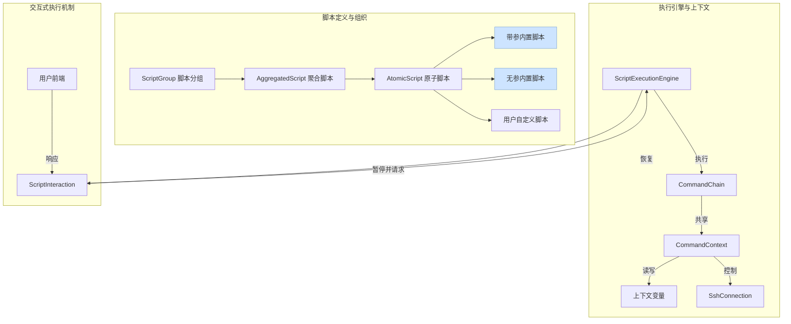

# SSH 终端脚本管理系统 - 架构分析文档

**文档版本**: v1.1  
**更新时间**: 2025-08-01  
**目标**: 整合最新需求，提供完整的架构分析和开发指导

---

## 📋 目录

1. [整体架构设计](#1-整体架构设计)
2. [当前完成程度分析](#2-当前完成程度分析)
3. [未完成部分详述](#3-未完成部分详述)
4. [未完成部分技术方案](#4-未完成部分技术方案)
5. [架构评分与问题分析](#5-架构评分与问题分析)
6. [开发优先级建议](#6-开发优先级建议)
7. [技术债务清单](#7-技术债务清单)

---

## 1. 整体架构设计

### 1.1 系统分层架构

```
┌─────────────────────────────────────────────────────────────┐
│                    用户前端 (Vue 3)                           │
├─────────────────────────────────────────────────────────────┤
│  用户端                    │              管理端              │
│  - 脚本分组卡片展示         │  - 原子脚本管理 (含内置脚本)     │
│  - 聚合脚本执行界面         │  - 聚合脚本管理 (构建器)         │
│  - 实时进度与交互式输入     │  - 脚本分组管理 (多维度)         │
│  - SSH连接配置             │  - 用户权限管理                  │
└─────────────────────────────────────────────────────────────┘
┌─────────────────────────────────────────────────────────────┐
│                 后端服务层 (Spring Boot)                      │
├─────────────────────────────────────────────────────────────┤
│  Controller层              │  Service层                      │
│  - 交互式执行API           │  - 交互式脚本执行服务            │
│  - 统一脚本执行           │  - 上下文与状态管理服务          │
│  - 管理端API              │  - 统一脚本注册服务              │
│  - WebSocket消息处理       │  - SSH连接服务                   │
└─────────────────────────────────────────────────────────────┘
┌─────────────────────────────────────────────────────────────┐
│                     数据与脚本核心                             │
├─────────────────────────────────────────────────────────────┤
│  内置脚本 (代码)           │  数据库实体                      │
│  - 带参模板脚本 (e.g. Docker) │  - AtomicScript / AggregatedScript │
│  - 无参功能脚本 (e.g. DetectOS)│  - ScriptGroup / ScriptInteraction │
│  - 用户自定义脚本 (DB存储)  │  - ExecutionLog / ExecutionSession │
└─────────────────────────────────────────────────────────────┘
```

### 1.2 核心组件关系



### 1.3 交互式执行架构
本系统最大的亮点是支持脚本在执行过程中的动态交互。这套机制允许脚本暂停执行，向用户请求确认或输入信息，然后根据用户的反馈继续执行。
交互流程如下：
1. **后端发起交互**: ScriptEngine在执行到特定交互指令时，会暂停当前执行线程。
2. **持久化状态**: 系统将当前的执行状态（包括上下文变量）和交互请求（如问题、输入框类型）存入数据库（`ScriptInteraction`表）。
3. **通知前端**: 通过WebSocket向前端发送一个包含交互请求的消息。
4. **前端响应**: 用户前端收到消息后，渲染出相应的UI（如确认按钮、输入框）。
5. **用户提交**: 用户操作后，前端通过一个专用的REST API或WebSocket消息将响应（如 'yes', 'no', 用户输入的密码）发送回后端。
6. **后端恢复执行**: 后端接收到响应后，从数据库加载执行状态，将用户响应更新到`CommandContext`中，并恢复执行线程。


---

## 2. 当前完成程度分析

### 2.1 功能模块完成度

| 模块 | 预期功能 | 当前状态 | 完成度 | 关键问题 |
|---|---|---|---|---|
| **SSH连接管理** | 连接配置、测试、执行 | ✅ 基本完成 | **85%** | 连接池管理缺失 |
| **原子脚本管理** | 内置+用户脚本，支持参数化 | ❌ 概念待实现 | **30%** | **参数化内置脚本未实现** |
| **聚合脚本管理** | 脚本组合+构建器 | ❌ 基础框架 | **25%** | **构建器无保存功能** |
| **脚本分组管理** | 项目+配置驱动维度分组 | ❌ 单一分组 | **20%** | **多维度分组未实现** |
| **用户端展示** | 卡片式+左右分栏 | ❌ 列表页面 | **15%** | **核心展示逻辑缺失** |
| **执行进度监控** | 实时WebSocket日志 | ✅ 基本完成 | **75%** | **交互功能完全缺失** |
| **交互式执行** | 暂停、请求输入、确认 | ❌ 未实现 | **0%** | **系统核心亮点，架构需重构** |
| **权限管理** | 用户角色+权限控制 | ✅ 基本完成 | **70%** | 细粒度权限控制缺失 |

---

## 3. 未完成部分详述

### 3.1 🚨 关键功能缺失

#### 1. **交互式执行与用户确认 (新核心)**
```
当前状态: 完全未实现。执行是单向的，无法暂停或接收用户输入。
影响程度: ⭐⭐⭐⭐⭐ (系统核心价值缺失，无法满足业务需求)
具体问题:
- 无法实现: “当前服务器地址为中国国内，建议切换软件源(是/否)”
- 无法实现: “正在安装mysql，请输入root密码”
- 后端缺少完整的状态机来管理 Paused, Running, WaitingInput 等状态
- 前后端通信缺少交互协议
```

#### 2. **上下文变量传递与条件执行**
```
当前状态: 各脚本独立执行，`CommandContext`仅作为临时容器。
影响程度: ⭐⭐⭐⭐⭐ (核心业务逻辑缺失)
具体问题:
- 无法实现: 检测系统类型 → **根据上下文结果** 选择对应安装脚本
- 无法实现: 检测地理位置 → **根据上下文结果** 条件切换镜像源
- `CommandContext` 需要在聚合脚本的完整生命周期内持久化和传递
```

#### 3. **脚本与分组的重新设计**
```
当前状态: 脚本和分组都是单一、扁平的结构。
影响程度: ⭐⭐⭐⭐ (灵活性和可复用性差)
具体问题:
- 无法区分 **带参内置脚本** (如Docker模板) 和 **无参内置脚本** (如系统检测)
- 无法实现 **项目维度分组** (如MySQL管理) 和 **配置驱动分组** (如通用Docker项目部署)
- `ScriptGroup` 和 `AtomicScript` 的数据模型需要重大扩展
```

#### 4. **聚合脚本构建器保存功能**
```
当前状态: `ScriptBuilder.vue` 只能执行脚本组合，无法保存。
影响程度: ⭐⭐⭐⭐ (功能完整性问题)
具体问题:
- 用户配置的脚本组合无法持久化，无法创建可复用的聚合脚本
```

#### 5. **内置脚本管理界面集成**
```
当前状态: 12个内置脚本在代码中，管理界面看不到。
影响程度: ⭐⭐⭐ (功能完整性问题)
具体问题:
- `UnifiedScriptRegistrationService` 注册但界面不显示
- 用户无法了解、配置和使用系统提供的内置功能
```

---

## 4. 未完成部分技术方案

### 4.1 交互式执行方案 (新)

#### 数据库设计
```sql
-- 交互记录表
CREATE TABLE script_interaction (
  id BIGINT AUTO_INCREMENT PRIMARY KEY,
  execution_session_id BIGINT NOT NULL, -- 关联的执行会话
  prompt_message TEXT NOT NULL,          -- 显示给用户的提示信息
  interaction_type VARCHAR(50) NOT NULL, -- 'CONFIRMATION', 'TEXT_INPUT', 'PASSWORD'
  status VARCHAR(50) NOT NULL,           -- 'PENDING', 'COMPLETED', 'TIMED_OUT'
  response_data TEXT,                    -- 用户返回的数据
  created_at TIMESTAMP,
  responded_at TIMESTAMP
);
```

#### 后端技术方案
```java
// ScriptEngine 中增加交互逻辑
public void execute(Command command, CommandContext context) {
    if (command instanceof InteractiveCommand) {
        // 1. 创建 ScriptInteraction 实体并保存
        ScriptInteraction interaction = interactionService.createInteraction(context, command);
        // 2. 通过WebSocket发送交互请求到前端
        webSocketService.sendInteractionRequest(context.getSessionId(), interaction);
        // 3. 暂停当前执行线程 (例如使用 CompletableFuture 或 状态机)
        executionManager.pauseExecution(context.getSessionId());
    } else {
        // ...正常执行
    }
}

// 新增 Controller 用于接收前端响应
@PostMapping("/api/user/interactions/{interactionId}/respond")
public void handleInteractionResponse(@PathVariable Long interactionId, @RequestBody InteractionResponse response) {
    // 1. 验证并保存用户响应
    ScriptInteraction interaction = interactionService.completeInteraction(interactionId, response);
    // 2. 恢复执行
    executionManager.resumeExecution(interaction.getExecutionSessionId(), response.getData());
}
```

#### 前端技术方案
```javascript
// WebSocket 监听器中
ws.onmessage = (event) => {
  const message = JSON.parse(event.data);
  if (message.type === 'INTERACTION_REQUEST') {
    // 在界面上显示确认框或输入框
    showInteractionModal(message.payload);
  } else if (message.type === 'LOG') {
    // 显示日志
  }
};

// 交互模态框中的提交方法
async function submitInteraction(interactionId, responseData) {
  await http.post(`/api/user/interactions/${interactionId}/respond`, { data: responseData });
  // 关闭模态框
}
```

### 4.2 设计重构：脚本与分组 (新)

#### 数据库模型扩展
```java
// AtomicScript 实体扩展
@Enumerated(EnumType.STRING)
private ScriptType scriptType; // BUILT_IN_TEMPLATE, BUILT_IN_STATIC, USER_DEFINED

@Column(columnDefinition = "json")
private String parameterSchema; // JSON Schema 定义内置模板脚本的参数

// ScriptGroup 实体扩展
@Enumerated(EnumType.STRING)
private ScriptGroupType groupType; // PROJECT_ORIENTED, CONFIG_DRIVEN, FUNCTIONAL
```

#### 技术方案
1.  **带参内置脚本**：定义为 `ScriptType.BUILT_IN_TEMPLATE`。在 `AtomicScript` 中用 JSON Schema 定义其所需参数（如 `docker-compose.yaml` 内容，端口号等）。用户在创建聚合脚本或在项目中引用它时，需要填充这些参数，生成一个具体的、可执行的“脚本实例”。
2.  **分组维度**：
    *   **项目维度 (`PROJECT_ORIENTED`)**: 管理界面允许用户创建一个项目（如"我的博客"），然后在这个项目下挂载多个聚合脚本（安装、启动、备份）。
    *   **配置驱动维度 (`CONFIG_DRIVEN`)**: 这种分组下的聚合脚本（如"通用Docker部署"）可以被任何项目使用，只要在执行时提供符合其参数规范的配置文件（如 `docker-compose.yaml`）。

### 4.3 上下文变量传递机制 (增强)

#### 技术方案
```java
// EnhancedScriptContext - 在整个聚合脚本执行期间共享
public class EnhancedScriptContext {
    private final String executionSessionId;
    // 使用Redis或数据库支持分布式和持久化
    private final Map<String, Object> variables; 
    
    // 方法：set/get/hasVariable...
}

// ScriptExecutionService 中管理上下文生命周期
public void startAggregatedScript(AggregatedScript script) {
    // 1. 创建一个唯一的 executionSessionId
    // 2. 初始化一个 EnhancedScriptContext 并与 session 绑定
    // 3. 按顺序执行原子脚本，每个都传入同一个上下文实例
}
```

---

## 5. 架构评分与问题分析

### 5.1 架构评分 (修订后)

| 评估维度 | 得分 | 满分 | 说明 |
|---|---|---|---|
| **技术选型** | 8.5 | 10 | Spring Boot + Vue 3 技术栈成熟 |
| **代码结构** | 6.5 | 10 | 分层清晰，但交互逻辑将增加复杂性 |
| **扩展性** | 6.0 | 10 | 插件化基础存在，但交互和多维模型需重构 |
| **性能设计** | 6.0 | 10 | WebSocket和SSH连接管理，但状态持久化带来新瓶颈 |
| **用户体验** | **2.0** | 10 | **核心交互功能缺失，完全不满足需求** |
| **业务完整性** | **2.5** | 10 | **核心业务闭环完全断裂** |
| **可维护性** | 6.0 | 10 | 引入状态机和异步逻辑后，维护成本将显著增加 |

**总体评分: 5.4/10** ⭐⭐ (存在严重架构缺陷)

### 5.2 架构关键问题 (修订后)

#### 🔴 严重问题
1.  **交互机制完全缺失**: 系统核心亮点未实现，是当前架构的最大短板。
2.  **业务闭环不完整**: 脚本的参数化、组合、保存、执行、交互链路完全断裂。
3.  **数据模型过于简单**: 无法支持参数化的脚本和多维度的分组，可复用性极差。

#### 🟡 中等问题  
1.  **用户界面不匹配**: 前端展示与最终需求设计差距巨大。
2.  **错误处理机制简陋**: 缺乏对暂停、超时、失败重试等复杂场景的处理。
3.  **内置资源孤立**: 代码中的内置脚本与管理界面脱节。

---

## 6. 开发优先级建议

### 6.1 第一阶段 (3-5天) - 核心架构重构
```
P0: 交互式执行机制 (后端+前端)
  - 工作量: 12-16小时
  - 后端: 状态机、持久化、WebSocket协议
  - 前端: 交互模态框、响应API调用

P1: 上下文与条件执行
  - 工作量: 6-8小时
  - CommandContext增强与持久化
  - 实现基于上下文的条件判断执行

P2: 数据模型重构 (脚本与分组)
  - 工作量: 4-6小时
  - 扩展AtomicScript和ScriptGroup实体
  - 调整相关Service和Repository
```

### 6.2 第二阶段 (2-3天) - 功能闭环
```
P3: 聚合脚本构建器 (支持参数化)
  - 工作量: 6-8小时
  - 前端: 构建器UI支持配置参数
  - 后端: 保存API支持新的数据模型

P4: 内置脚本管理界面集成
  - 工作量: 3-4小时
  - 统一脚本查询API (区分不同类型)
  - 前端展示内置脚本(只读/配置)
```

### 6.3 第三阶段 (2-3天) - 用户体验优化
```
P5: 用户端首页重构
  - 工作量: 6-8小时
  - 卡片式布局，多维度分组展示
  - 左右分栏执行界面

P6: 错误处理与执行历史
```

---

## 7. 技术债务清单

- [ ] **状态管理**: 引入Saga或状态机模式管理复杂的脚本执行状态（Running, Paused, Waiting, Failed）。
- [ ] **组件拆分**: `ScriptBuilder.vue` 和 `InteractiveExecutionPanel.vue` 需要拆分成更小的、可复用的组件。
- [ ] **异步处理**: 后端执行线程管理需要优化，避免滥用线程或导致阻塞。
- [ ] **安全**: 对用户输入的交互响应数据进行严格的清理和验证。
- [ ] **SSH连接池**: 实现JSch连接池，提高资源复用率。
