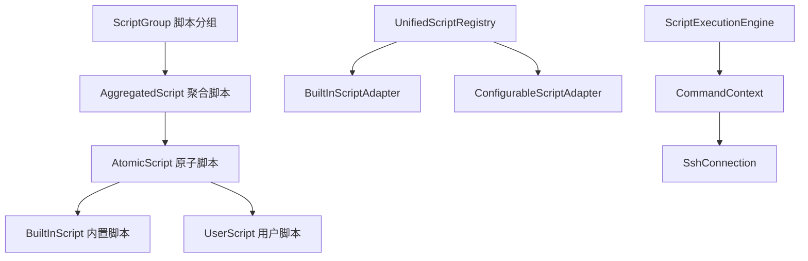

# SSH 终端脚本管理系统 - 架构分析文档

**文档版本**: v1.0  
**创建时间**: 2025-07-31  
**目标**: 为明天继续开发提供完整的架构分析和开发指导

---

## 📋 目录

1. [整体架构设计](#1-整体架构设计)
2. [当前完成程度分析](#2-当前完成程度分析)
3. [未完成部分详述](#3-未完成部分详述)
4. [未完成部分技术方案](#4-未完成部分技术方案)
5. [架构评分与问题分析](#5-架构评分与问题分析)
6. [开发优先级建议](#6-开发优先级建议)
7. [技术债务清单](#7-技术债务清单)

---

## 1. 整体架构设计

### 1.1 系统分层架构

```
┌─────────────────────────────────────────────────────────────┐
│                    用户前端 (Vue 3)                           │
├─────────────────────────────────────────────────────────────┤
│  用户端                    │              管理端              │
│  - 脚本分组卡片展示         │  - 原子脚本管理                  │
│  - 聚合脚本执行界面         │  - 聚合脚本管理                  │
│  - 实时进度监控            │  - 脚本分组管理                  │
│  - SSH连接配置             │  - 用户权限管理                  │
└─────────────────────────────────────────────────────────────┘
┌─────────────────────────────────────────────────────────────┐
│                 后端服务层 (Spring Boot)                      │
├─────────────────────────────────────────────────────────────┤
│  Controller层              │  Service层                      │
│  - SSH连接管理             │  - 脚本执行服务                  │
│  - 统一脚本执行           │  - 进度管理服务                  │
│  - 管理端API              │  - 脚本注册服务                  │
│  - 用户端API              │  - SSH连接服务                   │
└─────────────────────────────────────────────────────────────┘
┌─────────────────────────────────────────────────────────────┐
│                     数据层                                   │
├─────────────────────────────────────────────────────────────┤
│  内置脚本 (代码)           │  数据库实体                      │
│  - 预处理脚本 (2个)        │  - AtomicScript                │
│  - 环境检查脚本 (4个)      │  - AggregatedScript            │
│  - 系统增强脚本 (2个)      │  - ScriptGroup                 │
│  - 内置安装脚本 (4个)      │  - ExecutionLog                │
└─────────────────────────────────────────────────────────────┘
```

### 1.2 核心组件关系



---

## 2. 当前完成程度分析

### 2.1 功能模块完成度

| 模块 | 预期功能 | 当前状态 | 完成度 | 关键问题 |
|------|---------|---------|-------|----------|
| **SSH连接管理** | 连接配置、测试、执行 | ✅ 基本完成 | **85%** | 连接池管理缺失 |
| **原子脚本管理** | 内置+用户脚本管理 | ⚠️ 部分完成 | **60%** | **内置脚本未在管理界面显示** |
| **聚合脚本管理** | 脚本组合+构建器 | ❌ 基础框架 | **25%** | **构建器无保存功能** |
| **脚本分组管理** | 项目+功能维度分组 | ⚠️ 简单分组 | **40%** | **维度区分未实现** |
| **用户端展示** | 卡片式+左右分栏 | ❌ 列表页面 | **15%** | **核心展示逻辑缺失** |
| **执行进度监控** | 实时WebSocket | ✅ 基本完成 | **75%** | 多脚本协调执行待优化 |
| **权限管理** | 用户角色+权限控制 | ✅ 基本完成 | **70%** | 细粒度权限控制缺失 |

### 2.2 技术实现完成度

| 技术组件 | 实现状态 | 完成度 | 备注 |
|---------|---------|-------|------|
| **前端框架** | Vue 3 + Element Plus | **90%** | 基础组件齐全 |
| **后端框架** | Spring Boot 3.0.2 | **85%** | 核心功能完备 |
| **数据库设计** | MySQL + JPA | **75%** | 表结构基本完整 |
| **WebSocket通信** | 实时进度推送 | **80%** | 消息机制完善 |
| **SSH连接** | JSch库封装 | **85%** | 连接管理完善 |
| **脚本注册机制** | 统一注册表 | **70%** | 内置脚本集成待完善 |

---

## 3. 未完成部分详述

### 3.1 🚨 关键功能缺失

#### 1. **聚合脚本构建器保存功能**
```
当前状态: ScriptBuilder.vue 只能执行脚本组合，无法保存
影响程度: ⭐⭐⭐⭐⭐ (系统核心价值缺失)
具体问题:
- 用户配置的脚本组合无法持久化
- 无法创建可复用的聚合脚本
- 聚合脚本管理页面功能空洞
```

#### 2. **内置脚本管理界面集成**
```
当前状态: 12个内置脚本在代码中，管理界面看不到
影响程度: ⭐⭐⭐⭐ (功能完整性问题)
具体问题:
- 内置脚本: 预处理(2) + 环境检查(4) + 系统增强(2) + 内置安装(4)
- UnifiedScriptRegistrationService 注册但界面不显示
- 用户无法了解系统提供的内置功能
```

#### 3. **上下文变量传递机制**
```
当前状态: 各脚本独立执行，无法共享状态
影响程度: ⭐⭐⭐⭐⭐ (核心业务逻辑缺失)
具体问题:
- 无法实现: 检测系统类型 → 选择对应安装脚本
- 无法实现: 检测地理位置 → 条件切换镜像源
- CommandContext 上下文传递机制不完善
```

#### 4. **脚本分组维度区分**
```
当前状态: 单一分组模式
影响程度: ⭐⭐⭐ (用户体验问题)
具体问题:
- 缺少项目维度: MySQL管理、Redis管理、Docker管理
- 缺少功能维度: 环境初始化、监控运维、备份恢复
- ScriptGroup 实体需要扩展维度字段
```

#### 5. **用户端首页展示**
```
当前状态: 简单列表页面
影响程度: ⭐⭐⭐⭐ (用户界面核心缺失)
具体问题:
- 无脚本分组卡片展示
- 无左侧聚合脚本列表 + 右侧执行进度的布局
- 用户体验不匹配需求设计
```

### 3.2 ⚠️ 次要功能缺失

- **脚本依赖关系管理**: 脚本间的前置条件和依赖执行
- **条件执行逻辑**: if/else 条件分支执行
- **错误处理策略**: 失败重试、跳过、中断等策略
- **执行历史查询**: 历史执行记录和日志查询
- **脚本模板系统**: 快速创建常用脚本组合模板

---

## 4. 未完成部分技术方案

### 4.1 聚合脚本构建器保存功能

#### 技术方案
```javascript
// 前端 - ScriptBuilder.vue 新增保存方法
const saveAggregatedScript = async () => {
  const aggregatedScript = {
    name: scriptName.value,
    description: scriptDescription.value,
    scriptIds: scriptCommands.value.map(cmd => cmd.id),
    executionOrder: scriptCommands.value.map((cmd, index) => ({
      scriptId: cmd.id,
      order: index + 1,
      conditions: cmd.conditions || null
    })),
    groupId: selectedGroupId.value,
    status: 'ACTIVE'
  }
  
  const response = await http.post('/api/admin/aggregated-scripts', aggregatedScript)
  // 处理保存结果
}
```

#### 后端API扩展
```java
// AggregatedScriptController 新增保存接口
@PostMapping
public ResponseEntity<AggregatedScript> createAggregatedScript(
    @RequestBody AggregatedScriptCreateRequest request) {
    // 保存聚合脚本逻辑
}
```

### 4.2 内置脚本管理界面集成

#### 技术方案
```java
// 扩展 AtomicScriptController 支持内置脚本查询
@GetMapping("/unified")
public ResponseEntity<List<UnifiedAtomicScriptDTO>> getAllUnifiedScripts() {
    // 合并内置脚本和用户脚本
    List<UnifiedAtomicScript> builtInScripts = scriptRegistry.getBuiltInScripts();
    List<AtomicScript> userScripts = atomicScriptService.getAllActiveScripts();
    
    // 转换为统一DTO返回
}
```

#### 前端界面调整
```javascript
// AtomicScripts.vue 显示内置脚本，但禁止编辑删除
const isBuiltInScript = (script) => {
  return script.scriptType === 'BUILT_IN'
}
```

### 4.3 上下文变量传递机制

#### 技术方案
```java
// 增强 CommandContext
public class CommandContext {
    private Map<String, Object> contextVariables = new HashMap<>();
    
    public void setVariable(String key, Object value) {
        contextVariables.put(key, value);
    }
    
    public <T> T getVariable(String key, Class<T> type) {
        return type.cast(contextVariables.get(key));
    }
    
    public boolean hasVariable(String key) {
        return contextVariables.containsKey(key);
    }
}

// 条件执行逻辑
public class ConditionalExecutor {
    public boolean shouldExecute(ScriptCondition condition, CommandContext context) {
        // 根据上下文变量判断是否执行
    }
}
```

---

## 5. 架构评分与问题分析

### 5.1 架构评分

| 评估维度 | 得分 | 满分 | 说明 |
|---------|------|------|------|
| **技术选型** | 8.5 | 10 | Spring Boot + Vue 3 技术栈成熟 |
| **代码结构** | 7.0 | 10 | 分层清晰，但业务逻辑分散 |
| **扩展性** | 6.5 | 10 | 插件化架构基础存在，待完善 |
| **性能设计** | 7.0 | 10 | WebSocket实时通信，SSH连接管理合理 |
| **用户体验** | 4.0 | 10 | 界面功能不完整，操作流程不顺畅 |
| **业务完整性** | 4.5 | 10 | 核心业务逻辑缺失 |
| **可维护性** | 7.5 | 10 | 代码规范良好，但复杂度较高 |

**总体评分: 6.4/10** ⭐⭐⭐

### 5.2 架构关键问题

#### 🔴 严重问题
1. **业务闭环不完整**: 聚合脚本构建→保存→管理→执行 链路断裂
2. **内置资源孤立**: 代码中的内置脚本与管理界面脱节
3. **上下文传递缺失**: 无法实现脚本间状态共享和条件执行

#### 🟡 中等问题  
1. **用户界面不匹配**: 前端展示与需求设计差距较大
2. **数据模型不完善**: 脚本分组维度支持不足
3. **错误处理机制简陋**: 缺乏完善的异常处理策略

#### 🟢 轻微问题
1. **性能优化空间**: SSH连接池、缓存机制待优化
2. **监控体系不完善**: 缺少执行统计和性能监控
3. **文档和测试不足**: 技术文档和单元测试覆盖率低

---

## 6. 开发优先级建议

### 6.1 第一阶段 (1-2天) - 核心功能完善
```
P0: 聚合脚本构建器保存功能
  - 工作量: 4-6小时
  - 前端: 保存界面、表单验证
  - 后端: 保存API、数据持久化

P1: 内置脚本管理界面集成  
  - 工作量: 3-4小时
  - 统一脚本查询API
  - 前端展示内置脚本(只读)

P2: 上下文变量传递机制
  - 工作量: 6-8小时
  - CommandContext增强
  - 条件执行逻辑实现
```

### 6.2 第二阶段 (2-3天) - 用户体验优化
```
P3: 脚本分组维度区分
  - 工作量: 4-5小时
  - 数据模型扩展
  - 管理界面调整

P4: 用户端首页重构
  - 工作量: 6-8小时
  - 卡片式布局设计
  - 左右分栏执行界面
```

### 6.3 第三阶段 (1-2天) - 功能完善
```
P5: 脚本依赖关系管理
P6: 错误处理策略优化
P7: 执行历史查询功能
```

---

## 7. 技术债务清单

### 7.1 代码质量问题
- [ ] ScriptBuilder.vue 文件过大(1362行)，需要组件拆分
- [ ] 业务逻辑与UI逻辑耦合，需要抽取Service层
- [ ] 异常处理不统一，需要全局异常处理机制
- [ ] 日志记录不完善，缺少关键操作日志

### 7.2 架构设计问题
- [ ] 内置脚本与数据库脚本管理方式不统一
- [ ] 脚本执行状态管理复杂，需要状态机优化
- [ ] SSH连接管理缺少连接池，资源利用不当
- [ ] WebSocket消息订阅机制需要优化，避免内存泄漏

### 7.3 性能优化点
- [ ] 大量脚本加载时的分页和懒加载
- [ ] 脚本执行并发控制和资源限制
- [ ] WebSocket连接数控制和负载均衡
- [ ] 数据库查询优化和索引建立

---

## 📝 明天开发建议

1. **立即修复**: 从聚合脚本构建器保存功能开始
2. **重点关注**: 内置脚本与管理界面的集成显示
3. **架构优化**: 逐步引入上下文变量传递机制
4. **用户体验**: 重构用户端首页展示逻辑

**预计时间安排**: 按照优先级，前两个问题需要1-2天完成，可以显著提升系统完整性。

---

*文档创建于 2025-07-31 晚上，供明天继续开发参考*