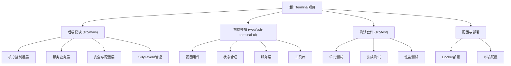

# CLAUDE.md

## 变更记录 (Changelog)

### 2025-08-22 16:05:35 - AI上下文初始化
- 自动生成项目架构文档和模块索引
- 识别出核心Spring Boot后端和Vue 3前端双架构
- 完成模块级文档生成（后端、前端、SillyTavern管理、测试套件）
- 建立覆盖率度量体系

---

This file provides guidance to Claude Code (claude.ai/code) when working with code in this repository.

## 项目愿景

**终端管理系统** - 一个基于Spring Boot + Vue 3的企业级SSH终端管理和AI服务部署平台，提供安全的远程终端访问、文件传输、系统监控以及SillyTavern Docker容器的完整生命周期管理。

## 架构总览

本项目采用**前后端分离架构**，包含以下核心技术栈：

### 后端技术栈 (Spring Boot 3.0.2)
- **核心框架**: Spring Boot Web + WebSocket + WebFlux 
- **通信协议**: STOMP over WebSocket + HTTP流式传输
- **SSH操作**: JSch 0.1.55 提供SSH/SFTP功能
- **安全机制**: RSA加密 + JWT令牌 + CORS策略
- **监控观测**: Spring Actuator + Micrometer Prometheus

### 前端技术栈 (Vue 3.5.17 + TypeScript)
- **核心框架**: Vue 3 Composition API + TypeScript 5.9.2
- **构建工具**: Vite 7.0.0 + Vue DevTools
- **状态管理**: Pinia 3.0.3
- **通信**: STOMP.js + xterm.js 终端模拟

## 模块结构图



## 模块索引

| 模块名称 | 路径 | 技术栈 | 职责描述 |
|---------|------|--------|---------|
| **后端核心** | `src/main` | Spring Boot 3.0.2 | SSH终端、SFTP传输、WebSocket通信、安全认证 |
| **前端界面** | `web/ssh-treminal-ui` | Vue 3 + TS + Vite | 终端UI、文件管理、实时通信、SillyTavern控制台 |
| **SillyTavern管理** | `src/main/java/.../sillytavern` | Docker API | AI服务容器部署、配置管理、版本控制、日志监控 |
| **测试套件** | `src/test` | JUnit + Spring Test | 安全测试、集成测试、性能测试、用户体验测试 |
| **部署配置** | `.` (根目录) | Docker + Maven | 容器化部署、环境配置、CI/CD脚本 |

## 运行与开发

### 快速启动
```bash
# 后端启动 (端口: 8100)
mvn spring-boot:run

# 前端启动 (端口: 5174)  
cd web/ssh-treminal-ui
npm install && npm run dev

# 应用访问
open http://localhost:5174
```

### 核心端点
- **WebSocket STOMP**: `ws://localhost:8100/ws/terminal`
- **HTTP流式传输**: `http://localhost:8100/api/streaming/*`
- **健康监控**: `http://localhost:8100/actuator/health`

## 测试策略

### 测试分层
1. **单元测试**: 服务层逻辑、工具类、安全组件
2. **集成测试**: STOMP通信、文件传输、Docker操作
3. **性能测试**: 大文件传输、并发连接、内存使用
4. **安全测试**: RSA加密、认证流程、CORS策略

### 测试覆盖重点
- SillyTavern全生命周期管理
- 文件传输中断恢复机制  
- WebSocket连接稳定性
- 多环境配置正确性

## 编码规范

### 后端规范 (Java)
- **架构原则**: 分层架构，Controller -> Service -> Repository模式
- **命名约定**: 
  - Controller: `*StompController` / `*Controller`
  - Service: `*Service`  
  - DTO: `*Dto`
- **异常处理**: 全局异常处理器 + 统一错误响应格式
- **日志记录**: SLF4J + Logback，结构化JSON日志

### 前端规范 (Vue 3 + TypeScript)
- **组件命名**: PascalCase组件名，kebab-case文件名
- **状态管理**: Pinia stores按功能模块划分
- **TypeScript**: 严格类型检查，完整类型定义
- **代码风格**: ESLint + Prettier自动格式化

## AI使用指引

### 开发任务类型
1. **功能增强**: 重点关注WebSocket通信、文件传输优化
2. **安全加固**: RSA加密实现、认证机制完善
3. **性能调优**: 大文件处理、内存管理、并发控制
4. **SillyTavern集成**: Docker API集成、容器生命周期管理

### 关键约束
- **安全第一**: 所有SSH凭据必须RSA加密传输
- **内存安全**: 文件传输采用流式处理，避免内存溢出
- **连接稳定**: WebSocket断线重连机制必须可靠
- **多环境支持**: dev/test/prod配置文件完整性

### 代码修改注意事项
- 修改文件传输配置需同时更新前后端
- STOMP消息映射修改需更新前端对应的composables
- Docker操作相关代码需考虑跨平台兼容性
- 安全相关修改需同步更新测试用例

---

*本文档由AI自动生成和维护，最后更新: 2025-08-22 16:05:35*