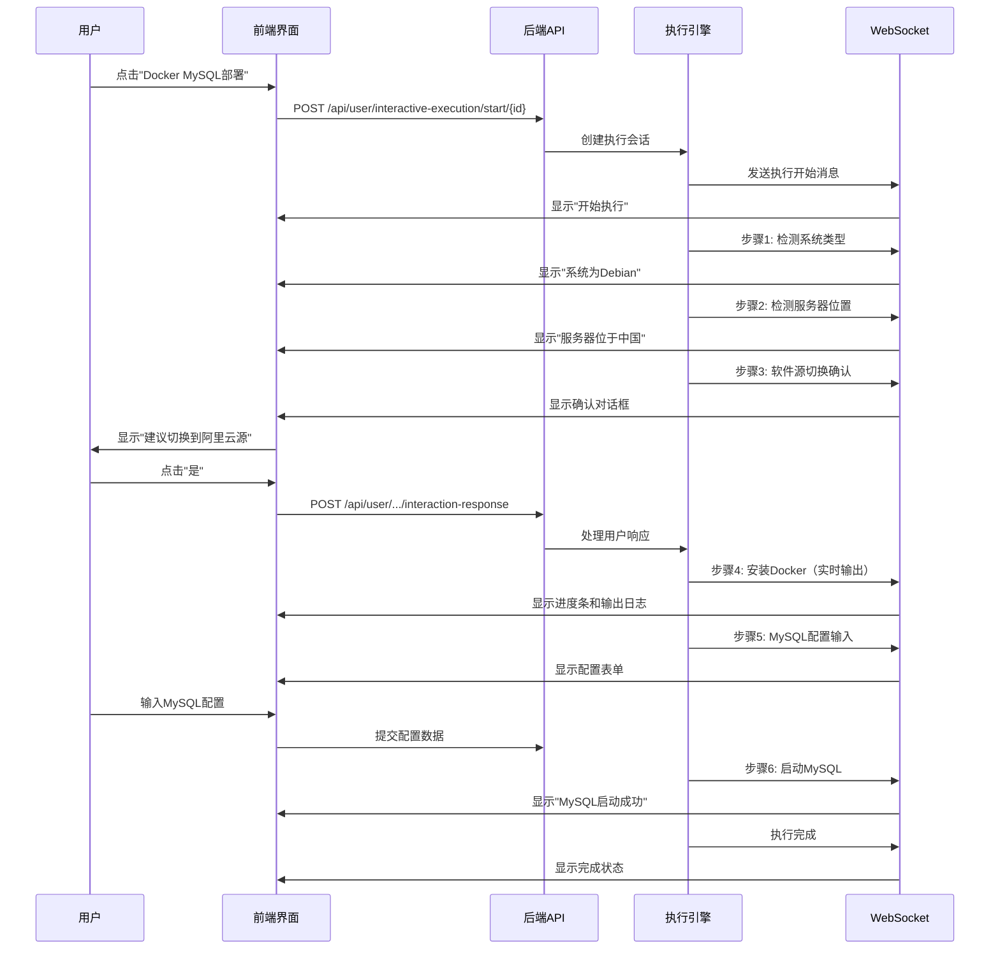

# 交互式脚本执行系统使用指南

## 系统概览

新的交互式脚本执行系统实现了以下核心功能：

1. **实时反馈**：每个执行步骤都有实时状态更新和输出显示
2. **智能交互**：基于上下文条件自动判断是否需要用户确认或输入
3. **流程可视化**：用户可以清楚看到整个执行过程的进度和状态
4. **灵活中断**：支持执行暂停、取消和恢复

## 数据库部署

### 1. 更新数据库结构
```sql
-- 执行更新脚本
mysql -u root -p your_database < database/update_interactive_schema.sql
```

### 2. 插入示例数据
```sql
-- 插入交互式脚本示例数据
mysql -u root -p your_database < database/insert_interactive_sample_data.sql
```

## 系统架构

### 实体类结构
```
交互式脚本执行系统
├── 原子脚本管理层
│   ├── 内置静态脚本（StaticAtomicScript）
│   ├── 内置参数化脚本（ParameterizedAtomicScript）
│   ├── 用户简单脚本（SimpleAtomicScript）
│   └── 用户模板脚本（TemplateAtomicScript）
│
├── 聚合脚本管理层
│   ├── 通用模板聚合脚本（GenericAggregateScript）
│   └── 项目特定聚合脚本（ProjectSpecificAggregateScript）
│
├── 脚本分组管理层
│   ├── 项目维度分组（ProjectDimensionGroup）
│   └── 功能维度分组（FunctionDimensionGroup）
│
└── 交互式执行引擎
    ├── 实时反馈机制
    ├── 用户交互处理
    ├── 上下文变量管理
    └── WebSocket通信
```

## 使用示例

### 1. MySQL部署聚合脚本执行流程



### 2. 前端页面访问

访问交互式脚本页面：
```
http://localhost:8080/interactive-scripts
```

页面功能：
- 左侧显示脚本分组（项目维度 + 功能维度） 
- 右侧显示选中分组下的聚合脚本
- 点击脚本执行按钮弹出交互式执行面板
- 实时显示执行进度和交互请求

### 3. API接口

#### 开始执行脚本
```http
POST /api/user/interactive-execution/start/{aggregateScriptId}
Response: {
  "success": true,
  "sessionId": "uuid",
  "scriptName": "Docker MySQL部署",
  "message": "脚本执行已开始"
}
```

#### 处理交互响应
```http
POST /api/user/interactive-execution/interaction-response/{sessionId}
Body: {
  "interactionId": "step_id",
  "response": "用户响应数据",
  "responseTime": 1623456789000
}
```

#### WebSocket消息格式
```json
{
  "stepId": "step_1",
  "stepName": "检测系统类型",
  "status": "COMPLETED",
  "message": "系统为Debian",
  "output": "Debian GNU/Linux 11",
  "timestamp": 1623456789000,
  "interaction": {
    "type": "CONFIRM_RECOMMENDATION",
    "prompt": "建议切换软件源",
    "options": ["是", "否"]
  }
}
```

## 核心特性

### 1. 原子脚本类型

- **内置静态脚本**：系统预定义，不需要参数，如"检测操作系统"
- **内置参数化脚本**：系统预定义，需要参数，如"切换软件源"
- **用户简单脚本**：用户自定义的简单命令
- **用户模板脚本**：支持变量替换的脚本模板

### 2. 交互模式

- **SILENT**：静默执行，无交互
- **CONFIRMATION**：需要用户确认
- **INPUT_REQUIRED**：需要用户输入
- **CONDITIONAL**：条件交互（基于上下文决定）
- **REALTIME_OUTPUT**：实时输出（长时间运行的脚本）

### 3. 聚合脚本类型

- **通用模板**：可复用的模板，如"Docker项目部署"
- **项目特定**：针对特定项目的脚本，如"MySQL数据库管理"

### 4. 脚本分组类型

- **项目维度**：按项目分组，如"MySQL管理"、"Redis管理"
- **功能维度**：按功能分组，如"环境初始化"、"监控运维"

## 扩展指南

### 1. 添加新的原子脚本

```sql
INSERT INTO atomic_scripts (name, description, script_content, script_type_enum, interaction_mode, interaction_config, ...)
VALUES ('new_script', '新脚本描述', 'echo "Hello"', 'USER_SIMPLE', 'SILENT', '{}', ...);
```

### 2. 创建聚合脚本

```sql
-- 创建聚合脚本
INSERT INTO aggregated_scripts (name, description, type, ...)
VALUES ('new_aggregate', '新聚合脚本', 'GENERIC_TEMPLATE', ...);

-- 关联原子脚本
INSERT INTO aggregate_atomic_relations (aggregate_id, atomic_id, execution_order, ...)
VALUES (1, 1, 1, '{}');
```

### 3. 自定义交互类型

在 `InteractionType` 枚举中添加新的交互类型，并在前端组件中实现相应的UI逻辑。

## 故障排除

### 1. WebSocket连接失败
- 检查WebSocket配置
- 确认端口是否正确
- 查看防火墙设置

### 2. 交互响应超时
- 检查用户响应处理逻辑
- 确认会话ID是否正确
- 查看执行引擎日志

### 3. 脚本执行失败
- 检查原子脚本内容
- 确认系统权限
- 查看执行日志表

## 总结

新的交互式脚本执行系统提供了：

1. **用户友好的交互体验**：智能建议 + 用户最终决定
2. **高度可扩展的架构**：支持新的交互类型和脚本类型
3. **实时反馈机制**：用户可以随时了解执行状态
4. **灵活的组织方式**：支持项目维度和功能维度的双重分组

通过这个系统，用户可以更加直观、安全地执行复杂的部署和管理任务。